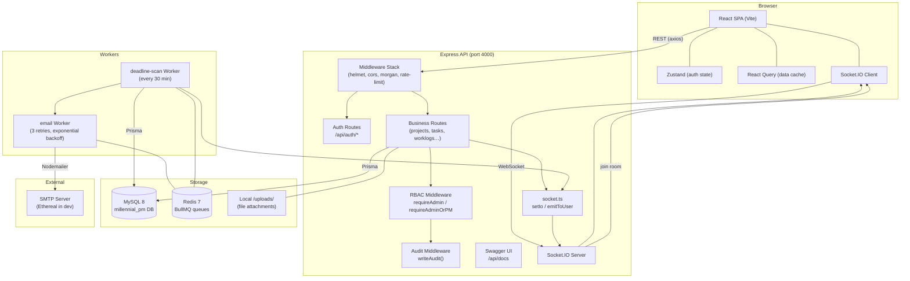
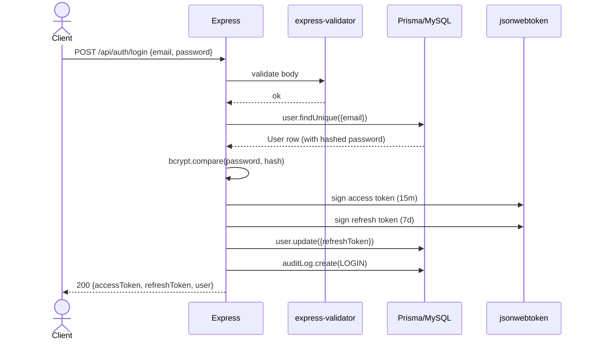
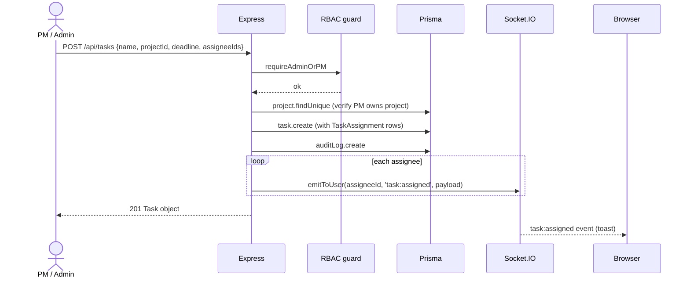
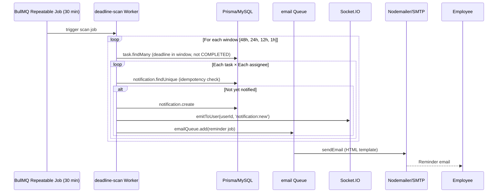
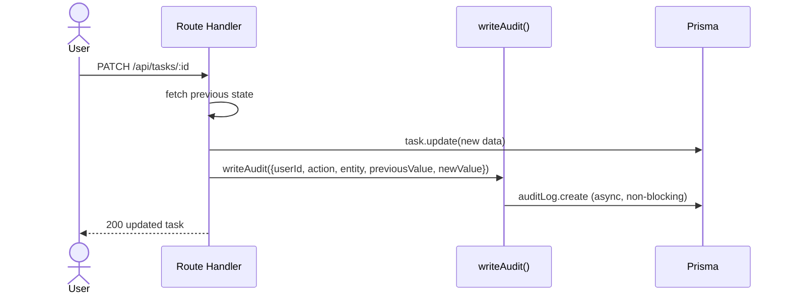

# Architecture

## System Overview

Millennial PM is a monorepo containing two applications that communicate via a REST API and a WebSocket layer:

```
millennial-pm-system/
├── apps/
│   ├── api/   — Node.js / Express / TypeScript backend
│   └── web/   — React 18 / Vite / TypeScript frontend
└── docs/      — this documentation
```

---

## Component Diagram



---

## Request Flow Diagrams

### Auth — Login



### Task Creation



### Deadline Reminder Firing



### Audit Logging



---

## RBAC Model

Three roles are stored as an enum in the `User.role` column.

| Action                        | ADMIN | PROJECT_MANAGER | EMPLOYEE |
|-------------------------------|:-----:|:---------------:|:--------:|
| Create / delete users         | ✅    | ❌              | ❌       |
| Create / delete projects      | ✅    | ❌              | ❌       |
| Update any project            | ✅    | own only        | ❌       |
| Create / update any task      | ✅    | own project     | status only |
| Assign employees to tasks     | ✅    | own project     | ❌       |
| Submit work logs              | ✅    | ✅              | own tasks |
| Reply to work logs            | ✅    | own project     | own logs |
| View all audit logs           | ✅    | ❌              | ❌       |
| View all reports              | ✅    | own projects    | ❌       |
| Receive email reminders       | ✅    | ✅              | ✅       |

### Implementation

```
authenticate()       — verifies JWT, attaches req.user
requireRole(...roles) — checks req.user.role against the whitelist
requireAdmin         — alias for requireRole(ADMIN)
requireAdminOrPM     — alias for requireRole(ADMIN, PROJECT_MANAGER)
```

Project-level scoping (PM can only touch their own projects) is enforced inside
each route handler via the `canManageTask()` / `canAccessProject()` helpers that
look up the project's `managerId` against `req.user.userId`.

---

## Queue / Scheduler Design

```
scanQueue ("deadline-scan")
  └── repeatable job — pattern: "*/30 * * * *"
        ↓ scanAndEnqueueReminders()
              ↓ for each [48h, 24h, 12h, 1h] window
                    ↓ Notification.findUnique (idempotency)
                    ↓ Notification.create
                    ↓ Socket.IO emit
                    ↓ emailQueue.add(job)

emailQueue ("email")
  └── per-message job
        ↓ Nodemailer.sendMail()
        retry: 3 × exponential back-off starting at 5 s
```

**Idempotency strategy** — The `Notification` table has a unique composite
index `(userId, taskId, type)`.  Before enqueuing an email the scanner performs
a `findUnique` on that compound key.  If the row already exists the entire
reminder block is skipped.  This means:

1. The scheduler can run more frequently without double-sending.
2. A Redis outage followed by a re-run will not re-send already-delivered mail.
3. The unique constraint acts as a natural deduplication fence even if the
   worker crashes mid-scan and restarts.

---

## Data Flow for File Attachments

```
POST /api/worklogs (multipart/form-data)
  ↓ multer middleware (apps/api/uploads/)
  ↓ filename stored in WorkLog.attachmentUrl ("/uploads/<timestamp>-<name>")
  ↓ served as static file at /uploads/<filename>
```

In production, replace the `multer.diskStorage` engine with `multer-s3` and
point `attachmentUrl` at the CDN URL.  No route changes needed.

---

## Technology Decisions

| Decision | Choice | Rationale |
|----------|--------|-----------|
| ORM | Prisma | Type-safe queries, migration tooling, schema-as-source-of-truth |
| Queue | BullMQ | Redis-backed, repeatable jobs, per-job retry, battle-tested |
| Auth | JWT (access + refresh) | Stateless; refresh rotation invalidates stolen tokens |
| Email (dev) | Ethereal auto-account | Zero config; preview URLs logged to console |
| Frontend state | Zustand | Lightweight; `persist` middleware for auth across tabs |
| Data fetching | React Query v5 | Automatic cache invalidation, stale-while-revalidate |
| Drag-drop | Native HTML5 | Zero runtime dependency; sufficient for a Kanban demo |
| Socket server | Socket.IO | Room-based private delivery; fallback to polling |
