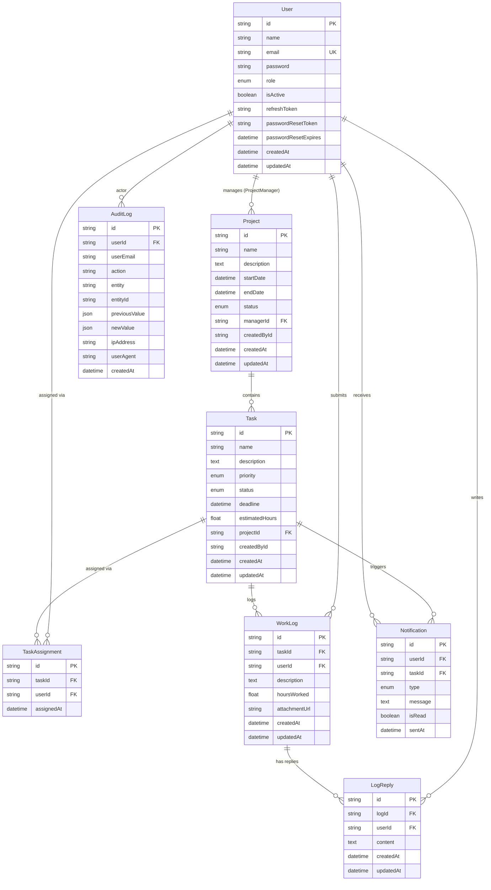

# Data Model

## Entity Relationship Diagram

---

## Table Reference

### `User`

Stores all system actors.  The `role` enum determines what data and actions each
user can access.

| Column               | Type          | Constraints              | Notes |
|----------------------|---------------|--------------------------|-------|
| `id`                 | VARCHAR(191)  | PK, UUID                 | UUID v4 generated by application |
| `name`               | VARCHAR(191)  | NOT NULL                 | Display name |
| `email`              | VARCHAR(191)  | NOT NULL, UNIQUE         | Login identifier |
| `password`           | VARCHAR(191)  | NOT NULL                 | bcrypt hash (10 rounds) |
| `role`               | ENUM          | NOT NULL, DEFAULT EMPLOYEE | `ADMIN` \| `PROJECT_MANAGER` \| `EMPLOYEE` |
| `isActive`           | BOOLEAN       | DEFAULT true             | Soft-disable without deleting |
| `refreshToken`       | TEXT          | nullable                 | Stored on login; cleared on logout; rotated on refresh |
| `passwordResetToken` | VARCHAR(191)  | nullable                 | Random 32-byte hex; expires in 1 hour |
| `passwordResetExpires` | DATETIME    | nullable                 | Expiry timestamp for reset token |
| `createdAt`          | DATETIME      | DEFAULT NOW              | |
| `updatedAt`          | DATETIME      | auto-update              | |

**Indexes:** `email` (unique), `role`

---

### `Project`

Represents a work initiative.  One Project Manager is assigned; all tasks belong
to exactly one project.

| Column       | Type         | Constraints     | Notes |
|--------------|--------------|-----------------|-------|
| `id`         | VARCHAR(191) | PK, UUID        | |
| `name`       | VARCHAR(191) | NOT NULL        | |
| `description`| TEXT         | nullable        | |
| `startDate`  | DATETIME     | NOT NULL        | |
| `endDate`    | DATETIME     | NOT NULL        | Deadline for the overall project |
| `status`     | ENUM         | DEFAULT PLANNING | `PLANNING` \| `ACTIVE` \| `COMPLETED` \| `ARCHIVED` |
| `managerId`  | VARCHAR(191) | FK → User.id    | Must be a `PROJECT_MANAGER` user |
| `createdById`| VARCHAR(191) | nullable        | Admin who created the project |
| `createdAt`  | DATETIME     | DEFAULT NOW     | |
| `updatedAt`  | DATETIME     | auto-update     | |

**Indexes:** `managerId`, `status`, `endDate`

---

### `Task`

Core work item.  Belongs to one project; assigned to one or more employees via
`TaskAssignment`.

| Column          | Type         | Constraints      | Notes |
|-----------------|--------------|------------------|-------|
| `id`            | VARCHAR(191) | PK, UUID         | |
| `name`          | VARCHAR(191) | NOT NULL         | |
| `description`   | TEXT         | nullable         | |
| `priority`      | ENUM         | DEFAULT MEDIUM   | `LOW` \| `MEDIUM` \| `HIGH` \| `CRITICAL` |
| `status`        | ENUM         | DEFAULT TODO     | `TODO` \| `IN_PROGRESS` \| `IN_REVIEW` \| `COMPLETED` \| `BLOCKED` |
| `deadline`      | DATETIME     | NOT NULL         | Used by the scheduler for reminder windows |
| `estimatedHours`| DOUBLE       | nullable         | Planned effort |
| `projectId`     | VARCHAR(191) | FK → Project.id  | Cascade delete |
| `createdById`   | VARCHAR(191) | NOT NULL         | PM or Admin who created it |
| `createdAt`     | DATETIME     | DEFAULT NOW      | |
| `updatedAt`     | DATETIME     | auto-update      | |

**Indexes:** `projectId`, `status`, `priority`, `deadline`, `createdById`

---

### `TaskAssignment`

Join table linking tasks to employees.  Uses a composite unique key so the same
employee cannot be double-assigned.

| Column      | Type         | Constraints                         |
|-------------|--------------|-------------------------------------|
| `id`        | VARCHAR(191) | PK                                  |
| `taskId`    | VARCHAR(191) | FK → Task.id (cascade delete)       |
| `userId`    | VARCHAR(191) | FK → User.id (cascade delete)       |
| `assignedAt`| DATETIME     | DEFAULT NOW                         |

**Unique constraint:** `(taskId, userId)`  
**Indexes:** `userId`, `taskId`

---

### `WorkLog`

Employee progress entries against a task.  Supports an optional file attachment
stored locally (or S3 in production).

| Column         | Type         | Constraints           |
|----------------|--------------|----------------------|
| `id`           | VARCHAR(191) | PK                    |
| `taskId`       | VARCHAR(191) | FK → Task.id (cascade)|
| `userId`       | VARCHAR(191) | FK → User.id          |
| `description`  | TEXT         | NOT NULL              |
| `hoursWorked`  | DOUBLE       | NOT NULL, min 0.1     |
| `attachmentUrl`| VARCHAR(191) | nullable              |
| `createdAt`    | DATETIME     | DEFAULT NOW           |
| `updatedAt`    | DATETIME     | auto-update           |

**Indexes:** `taskId`, `userId`, `createdAt`

---

### `LogReply`

PM or Employee replies to a work log — enables a threaded conversation.

| Column    | Type         | Constraints            |
|-----------|--------------|------------------------|
| `id`      | VARCHAR(191) | PK                     |
| `logId`   | VARCHAR(191) | FK → WorkLog.id (cascade)|
| `userId`  | VARCHAR(191) | FK → User.id           |
| `content` | TEXT         | NOT NULL               |
| `createdAt`| DATETIME    | DEFAULT NOW            |
| `updatedAt`| DATETIME    | auto-update            |

**Index:** `logId`

---

### `Notification`

Persisted notification records created by the scheduler.  The composite unique
index `(userId, taskId, type)` is the idempotency key — the scheduler checks
before inserting so the same reminder is never sent twice.

| Column    | Type         | Constraints                                  |
|-----------|--------------|----------------------------------------------|
| `id`      | VARCHAR(191) | PK                                           |
| `userId`  | VARCHAR(191) | FK → User.id                                 |
| `taskId`  | VARCHAR(191) | FK → Task.id (set null on delete), nullable  |
| `type`    | ENUM         | `DEADLINE_48H` \| `DEADLINE_24H` \| `DEADLINE_12H` \| `DEADLINE_1H` \| `OVERDUE` |
| `message` | TEXT         | NOT NULL                                     |
| `isRead`  | BOOLEAN      | DEFAULT false                                |
| `sentAt`  | DATETIME     | DEFAULT NOW                                  |

**Unique constraint:** `(userId, taskId, type)`  
**Indexes:** `userId`, `taskId`, `sentAt`

---

### `AuditLog`

Immutable record of every mutating action.  `previousValue` / `newValue` are
JSON blobs that capture the before/after diff for debugging and compliance.

| Column         | Type         | Constraints       |
|----------------|--------------|-------------------|
| `id`           | VARCHAR(191) | PK                |
| `userId`       | VARCHAR(191) | FK → User.id (nullable, set null on delete) |
| `userEmail`    | VARCHAR(191) | nullable          | Snapshot in case user is later deleted |
| `action`       | VARCHAR(191) | NOT NULL          | e.g. `CREATE_TASK`, `UPDATE_TASK_STATUS`, `LOGIN` |
| `entity`       | VARCHAR(191) | NOT NULL          | e.g. `Task`, `Project`, `User` |
| `entityId`     | VARCHAR(191) | nullable          | The affected row's PK |
| `previousValue`| JSON         | nullable          | State before mutation |
| `newValue`     | JSON         | nullable          | Payload / state after mutation |
| `ipAddress`    | VARCHAR(191) | nullable          | |
| `userAgent`    | VARCHAR(191) | nullable          | |
| `createdAt`    | DATETIME     | DEFAULT NOW       | |

**Indexes:** `userId`, `entity`, `action`, `createdAt`

---

## Sample Rows

### Users (seeded)

| name      | email                  | role            |
|-----------|------------------------|-----------------|
| Admin User| admin@millennial.com   | ADMIN           |
| Sarah (PM)| pm@millennial.com      | PROJECT_MANAGER |
| John (PM) | pm2@millennial.com     | PROJECT_MANAGER |
| Alice (Dev)| emp1@millennial.com  | EMPLOYEE        |
| Bob (Dev) | emp2@millennial.com    | EMPLOYEE        |

### AuditLog actions catalog

| Action                | Entity     | Triggered by            |
|-----------------------|------------|-------------------------|
| `LOGIN`               | User       | POST /auth/login        |
| `LOGOUT`              | User       | POST /auth/logout       |
| `CREATE_USER`         | User       | POST /users             |
| `UPDATE_USER`         | User       | PATCH /users/:id        |
| `DELETE_USER`         | User       | DELETE /users/:id       |
| `CREATE_PROJECT`      | Project    | POST /projects          |
| `UPDATE_PROJECT`      | Project    | PATCH /projects/:id     |
| `DELETE_PROJECT`      | Project    | DELETE /projects/:id    |
| `CREATE_TASK`         | Task       | POST /tasks             |
| `UPDATE_TASK`         | Task       | PATCH /tasks/:id (PM)   |
| `UPDATE_TASK_STATUS`  | Task       | PATCH /tasks/:id (emp)  |
| `ASSIGN_TASK`         | Task       | POST /tasks/:id/assign  |
| `DELETE_TASK`         | Task       | DELETE /tasks/:id       |
| `SUBMIT_WORKLOG`      | WorkLog    | POST /worklogs          |
| `REPLY_WORKLOG`       | LogReply   | POST /worklogs/:id/replies |
